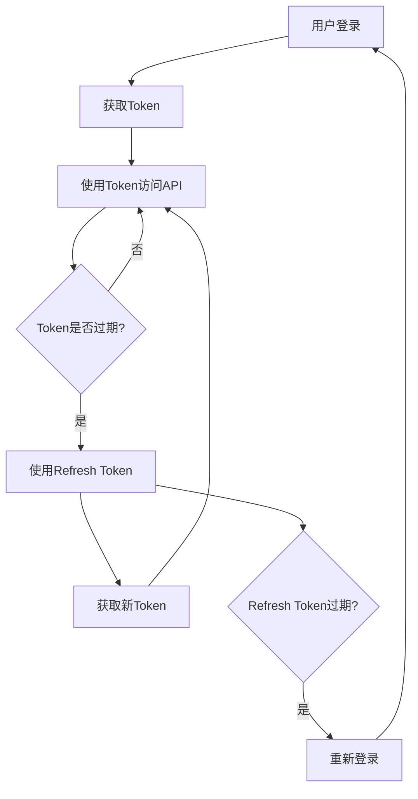

# 万象生活 API 接口文档

## 概述

本文档目录包含了万象生活项目的所有API接口文档，采用RESTful API设计规范，为前端开发和后端对接提供详细的接口说明。

## 文档结构

```
docs/api/
├── README.md          # API文档总览（本文件）
├── auth.md            # 认证系统接口文档
├── users.md           # 用户管理接口文档（待完善）
├── services.md        # 服务管理接口文档（待完善）
├── tasks.md           # 任务管理接口文档（待完善）
├── upload.md          # 文件上传接口文档（待完善）
└── examples/          # 接口调用示例
    ├── auth/
    ├── users/
    ├── services/
    └── tasks/
```

## 基础信息

### 服务器配置
- **开发环境：** `http://localhost:8080`
- **测试环境：** `https://test-api.universe-life.com`
- **生产环境：** `https://api.universe-life.com`

### 通用配置
- **API版本：** v1.0
- **数据格式：** JSON
- **字符编码：** UTF-8
- **认证方式：** JWT Bearer Token
- **HTTPS支持：** 是（测试和生产环境）

### 请求头配置
```http
Content-Type: application/json
Authorization: Bearer <access_token>  # 需要认证的接口
X-Request-ID: <request_id>          # 可选，用于问题追踪
X-Client-Version: <version>         # 可选，客户端版本
```

## 通用响应格式

所有API接口都遵循统一的响应格式：

```json
{
  "code": 0,                    // 业务状态码，0表示成功
  "message": "操作成功",         // 响应消息
  "data": {},                   // 响应数据
  "timestamp": 1699123456789,   // 时间戳
  "requestId": "req_123456"     // 请求ID（用于问题追踪）
}
```

### 状态码说明

| 状态码范围 | 说明 |
|------------|------|
| 0 | 成功 |
| 1000-1999 | 客户端错误（参数错误、验证失败等） |
| 2000-2999 | 权限错误（未授权、禁止访问等） |
| 3000-3999 | 业务逻辑错误 |
| 4000-4999 | 服务器错误 |
| 5000-5999 | 第三方服务错误 |

## 认证机制

### JWT Token认证
1. **获取Token：** 通过登录接口获取access_token和refresh_token
2. **使用Token：** 在请求头中添加`Authorization: Bearer <access_token>`
3. **刷新Token：** 当access_token过期时，使用refresh_token获取新的token
4. **Token有效期：**
   - Access Token：1小时
   - Refresh Token：30天

### 认证流程


## 接口分类

### 1. 认证系统 (`auth.md`)
包含用户注册、登录、密码管理、账户安全等核心认证功能。

**主要接口：**
- 用户注册、登录、登出
- 密码重置、修改
- 验证码发送和验证
- 第三方登录
- 账户绑定（手机号、邮箱）

### 2. 用户管理 (`users.md` - 待完善)
包含用户信息管理、个人资料设置等功能。

**主要接口：**
- 获取用户信息
- 更新用户资料
- 用户头像上传
- 用户偏好设置

### 3. 服务管理 (`services.md` - 待完善)
包含服务平台的各种服务相关接口。

**主要接口：**
- 服务列表查询
- 服务详情获取
- 服务搜索和筛选
- 服务分类管理

### 4. 任务管理 (`tasks.md` - 待完善)
包含任务发布、接单、管理等业务功能。

**主要接口：**
- 任务发布和编辑
- 任务列表和搜索
- 任务接单和完成
- 任务状态管理

### 5. 文件上传 (`upload.md` - 待完善)
包含各类文件上传相关接口。

**主要接口：**
- 图片上传
- 文件上传
- 上传进度查询
- 文件管理

## 错误处理

### HTTP状态码
| HTTP状态码 | 说明 | 处理建议 |
|------------|------|----------|
| 200 | 请求成功 | 正常处理响应数据 |
| 400 | 请求参数错误 | 检查请求参数格式和必填项 |
| 401 | 未授权 | 重新登录获取token |
| 403 | 权限不足 | 联系管理员或申请相应权限 |
| 404 | 资源不存在 | 检查请求URL和资源ID |
| 429 | 请求过于频繁 | 降低请求频率，等待限流解除 |
| 500 | 服务器错误 | 联系技术支持 |

### 常见业务错误码
| 错误码 | 说明 | 处理建议 |
|--------|------|----------|
| 1001 | 参数错误 | 检查参数格式和必填项 |
| 1002 | 用户不存在 | 检查用户名或引导注册 |
| 1003 | 密码错误 | 提示用户重新输入或找回密码 |
| 1005 | 验证码错误 | 提示用户重新获取验证码 |
| 1010 | Token无效 | 重新登录 |
| 1011 | Token过期 | 使用refresh_token刷新或重新登录 |

## 开发工具

### Postman集合
我们提供了完整的Postman集合文件，方便开发者测试接口：
- 下载地址：`/docs/api/examples/postman_collection.json`

### 在线文档
- Swagger UI：`https://api.universe-life.com/docs`
- 接口测试工具：`https://api.universe-life.com/test`

## 开发规范

### 1. 接口命名规范
- 使用RESTful风格
- 名词复数形式：`/api/users`
- 使用连字符分隔：`/api/user-profiles`
- 避免深层嵌套：最多3层

### 2. 请求参数规范
- 统一使用JSON格式
- 时间格式：ISO 8601 (`2023-11-04T12:00:00Z`)
- 分页参数：`page`, `pageSize`
- 排序参数：`sort`, `order`

### 3. 响应数据规范
- 统一响应格式
- 使用驼峰命名法
- 空值使用null而不是undefined
- 数组类型即使为空也要返回[]

### 4. 版本控制
- URL路径版本控制：`/api/v1/users`
- 向后兼容原则
- 废弃接口提前通知

## 测试指南

### 1. 环境准备
```bash
# 设置环境变量
export API_BASE_URL=http://localhost:8080
export ACCESS_TOKEN=your_access_token
```

### 2. 基础测试
```bash
# 测试连通性
curl -X GET $API_BASE_URL/api/health

# 测试认证
curl -X POST $API_BASE_URL/api/auth/login \
  -H "Content-Type: application/json" \
  -d '{"username":"test","password":"test"}'
```

### 3. 自动化测试
```bash
# 运行API测试套件
npm run test:api

# 生成测试报告
npm run test:api:report
```

## 监控和日志

### 接口监控
- 响应时间监控
- 错误率统计
- 请求量统计
- 性能指标追踪

### 日志记录
- 请求日志
- 错误日志
- 业务日志
- 安全日志

## 联系方式

如有API相关问题，请联系：

- **技术支持：** tech-support@universe-life.com
- **文档反馈：** docs-feedback@universe-life.com
- **问题报告：** https://github.com/universe-life/api-issues

## 更新日志

| 版本 | 日期 | 更新内容 |
|------|------|----------|
| v1.0.0 | 2023-11-04 | 创建API文档目录结构，完成认证系统文档 |
| v1.0.1 | 2023-11-05 | 完善文档结构，添加开发规范 |
| | | |

---

**文档维护：** 万象生活开发团队
**最后更新：** 2023-11-04
**版本：** v1.0.0